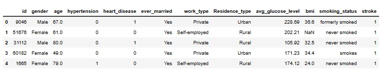
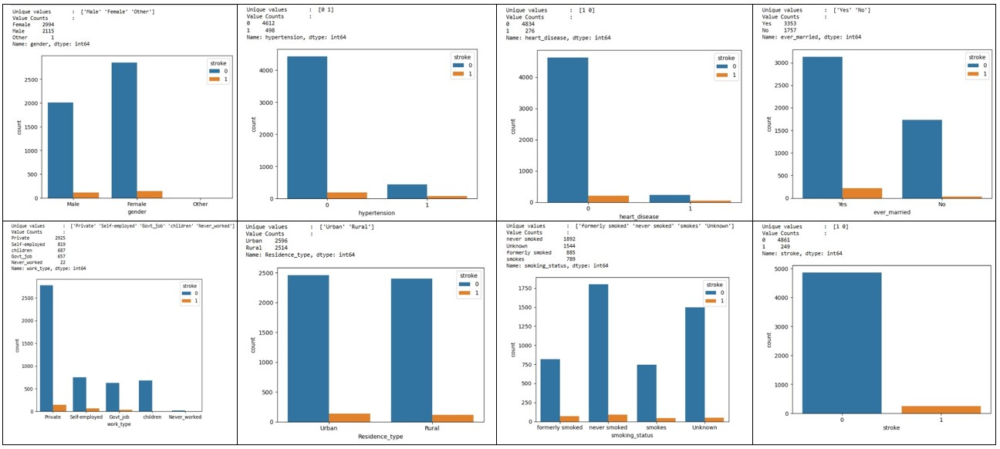
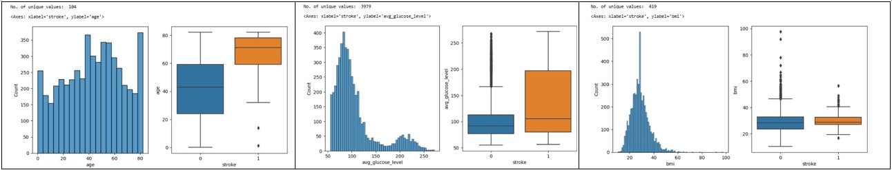

# Capstone Project - Stroke Prediction using Machine Learning

According to the World Stroke Organization (WSO), stroke is the second-leading cause of death in the world and the third-leading cause of death and disability combined. 
Stroke can be prevented with appropriate public policy action to address risk factors and increased public awareness.

The aim of this project is to develop and evaluate a suitable machine learning model to predict the risk of stroke. The project utilizes different features to identify everyone's risk of stroke. And to provide early preventive measures and/or treatments to the possible high risk groups.

 

## Role and Objective
As the author of the dataset did not indicated the source of the data, I would assume the dataset belongs to Hospital X, and I am working as an Data Analyst in Hospital X.

My task is to develop an suitable machine learning model to predict whom are the patients potential at risk of developing stroke based on hospital's patient information records.
This is to allow the hospital to identify these group of potential high risk patients (existing/new), to provide preventive measures or treatments as early as possible to to reduce the incidence rate/complications of the disease.

Reduction of incidence / complications of the disease would lessen the manpower and resources required to treat these patients, eg. shorter hospital stay, and lesser manpower required.

Patient's level of satisfactory could also be increased as the patient sees that the hospital showing genuine concerns regarding their health status, and would choose the hospital as the one to go to for any medical services required.

## Dataset
[Dataset Source](https://www.kaggle.com/datasets/fedesoriano/stroke-prediction-dataset "Kaggle Home")

##### Attribute Information
There are total 5110 records records in the dataset. 
There are 10 feature columns and 1 target column in the dataset.

|Attribute|Description|
|:--:|:--|
|gender|"Male", "Female" or "Other"|
|age|age of the patient|
|hypertension|0 if the patient doesn't have hypertension, 1 if the patient has hypertension|
|heart_disease|0 if the patient doesn't have any heart diseases, 1 if the patient has a heart disease|
|ever_married|"No" or "Yes"|
|work_type|"children", "Govt_jov", "Never_worked", "Private" or "Self-employed"|
|Residence_type|"Rural" or "Urban"|
|avg_glucose_level|average glucose level in blood|
|bmi|body mass index|
|smoking_status|"formerly smoked", "never smoked", "smokes" or "Unknown"* |
|stroke|1 if the patient had a stroke or 0 if not|

*Note: "Unknown" in smoking_status means that the information is unavailable for this patient
 

##### Sample of the dataset
<figure>
    
</figure>
 

##### Distribution of the dataset attributes

 

## Data Preprocessing
* Populate null values in BMI attribute with the average value of the column.
* Perform label encoding on categorical data, perform standardscaler() on continuous numeric data.
* Perform smote() or other possible random sampling to make data more balance, reduce overfitting.

## Models used in exploration
- Logistic Regression
- XGBoost

Splitting data into training & test sets. 
Compare & evaluate results on the different ML models, check if input parameters are suitable, and which settings more appropriate to generate good training & test results.
