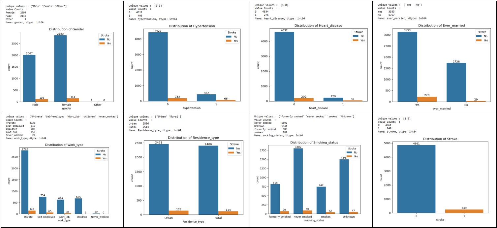
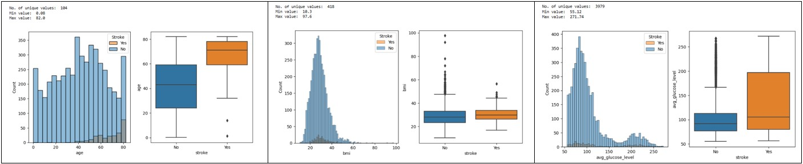

# Capstone Project - Stroke Prediction using Machine Learning

    
    

      According to the World Stroke Organization (WSO), stroke is the second-leading cause of death in the world and the third-leading cause of death and disability combined. 
Stroke can be prevented with appropriate public policy action to address risk factors and increased public awareness.

The aim of this project is to develop and evaluate a suitable machine learning model to predict the risk of stroke. The project utilizes different features to identify everyone's risk of stroke. And to provide early preventive measures and/or treatments to the possible high risk groups.
    

 

## Dataset
[Dataset Source](https://www.kaggle.com/datasets/fedesoriano/stroke-prediction-dataset "Kaggle Home")

##### Attribute Information
|id|unique identifier|
|:--:|:--|
|gender|"Male", "Female" or "Other"|
|age|age of the patient|
|hypertension|0 if the patient doesn't have hypertension, 1 if the patient has hypertension|
|heart_disease|0 if the patient doesn't have any heart diseases, 1 if the patient has a heart disease|
|ever_married|"No" or "Yes"|
|work_type|"children", "Govt_jov", "Never_worked", "Private" or "Self-employed"|
|Residence_type|"Rural" or "Urban"|
|avg_glucose_level|average glucose level in blood|
|bmi|body mass index|
|smoking_status|"formerly smoked", "never smoked", "smokes" or "Unknown"* |
|stroke|1 if the patient had a stroke or 0 if not|

*Note: "Unknown" in smoking_status means that the information is unavailable for this patient
 

##### Sample of the dataset
<figure>
    
</figure>
 

##### Distribution of the dataset fields
<figure>
    
    
</figure>
 

## Data Preprocessing
* show the data imbalance, outliers, null values in data, and then show how to taggle these issues.
* perform label encoding on categorical data, perform standardscaler() on continuous numeric data
* perform smote() or other possible random sampling to make data more balance, reduce overfitting

## Models used in exploration
Splitting data into training & test sets. Compare & evaluate results on the different ML models, check if input parameters are suitable, and which settings more appropriate to generate good training & test results
- Logistic Regression
- Random Forest
- XGBoost
- Support Vector Machine
